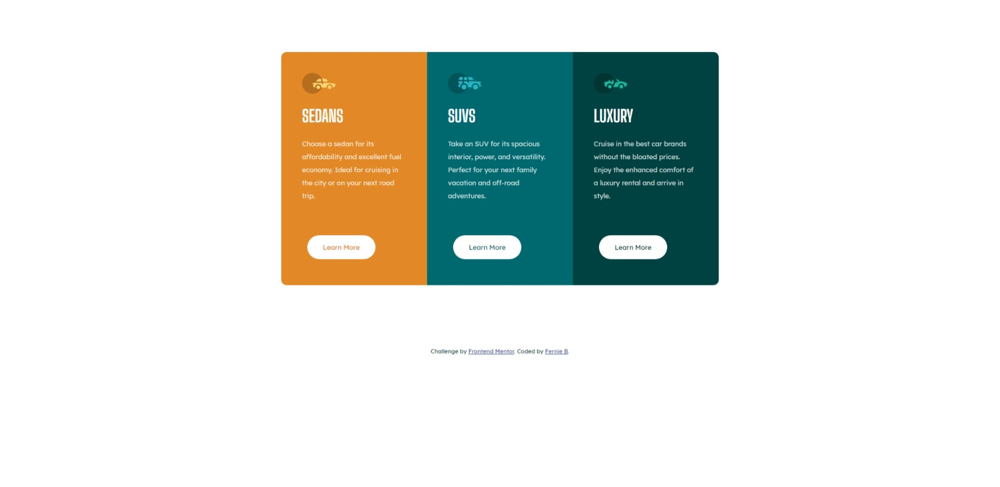

# Frontend Mentor - 3-column preview card component solution

This is a solution to the [3-column preview card component challenge on Frontend Mentor](https://www.frontendmentor.io/challenges/3column-preview-card-component-pH92eAR2-). Frontend Mentor challenges help you improve your coding skills by building realistic projects. 

## Table of contents

- [Overview](#overview)
  - [The challenge](#the-challenge)
  - [Screenshot](#screenshot)
  - [Links](#links)
- [My process](#my-process)
  - [Built with](#built-with)
  - [What I learned](#what-i-learned)
- [Author](#author)

**Note: Delete this note and update the table of contents based on what sections you keep.**

## Overview

### The challenge

Users should be able to:

- View the optimal layout depending on their device's screen size
- See hover states for interactive elements

### Screenshot





### Links

- Solution URL: [https://www.frontendmentor.io/challenges/3column-preview-card-component-pH92eAR2-](https://www.frontendmentor.io/challenges/3column-preview-card-component-pH92eAR2-)
- Live Site URL: [https://frontend-mentor-adventures.netlify.app/3-column-preview-card-component-main/](https://frontend-mentor-adventures.netlify.app/3-column-preview-card-component-main/)

## My process

### Built with

- Semantic HTML5 markup
- SASS ()
- Flexbox
- Mobile-first workflow

### What I learned

Major learning was the CSS compiled with SASS, using variables and segmented files

Compile CSS comand 
```
compile sass --watch sass:.
```

## Author

- Website - [Fernanda Broch](hhttps://fernandabroch.github.io/about-me/)
- Frontend Mentor - [@FernandaBroch](https://www.frontendmentor.io/profile/FernandaBroch)
